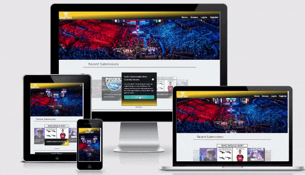
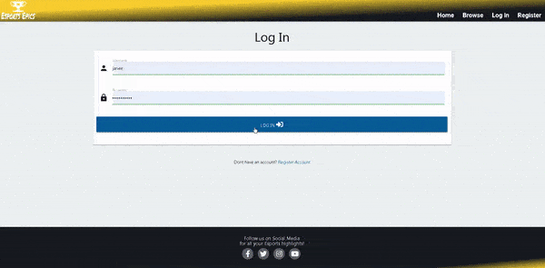
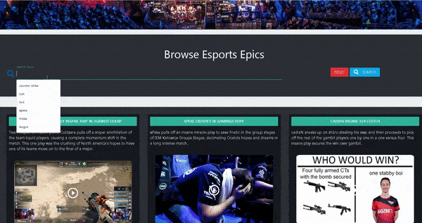
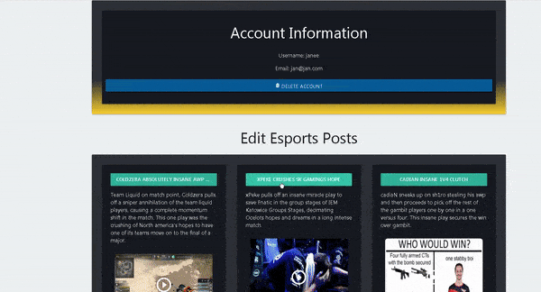
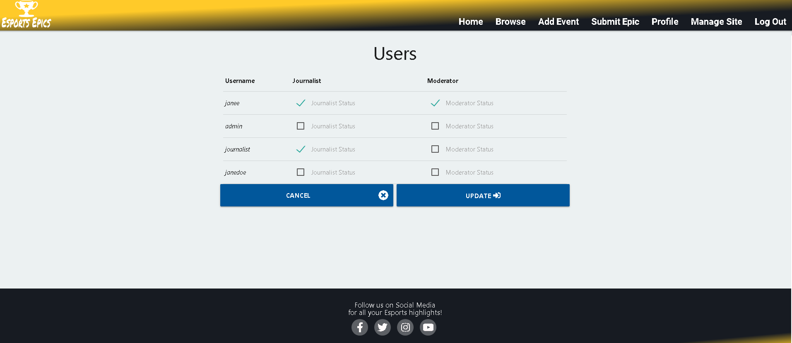
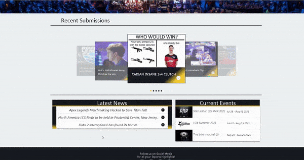

#     

[Esports Epics](https://esports-epics.herokuapp.com/) is a website to share the most nail biting, clutch 
and incredible competitive moments that occur in a variety of different genres of video games. When your opponents back 
is against the wall, they are forced to pull off epic feats to turn the odds back in their favour. Esports Epics is a 
place to capture these feats so that myself and you can learn and enjoy the best moments esports has to offer.
<h2 align="center"></h2>

## Table of Contents
1. [**UX**](#ux)
    - [**Project Goals**](#project-goals)
    - [**User Stories**](#user-stories)
    - [**Wireframe mock-ups**](#wireframe-mock-ups)
2. [**Features**](#features)
    - [**Home Page**](#home-page)
    - [**Source Code**](#source-code)
    - [**Existing Features**](#existing-features)
3. [**Technologies Used**](#technologies-used)
4. [**Testing**](#testing)
5. [**Deployment**](#deployment)
6. [**Bugs and Issues Resolved**](#bugs-and-issues-resolved)
7. [**Credits**](#credits)
    - [**Media**](#media)
    - [**Acknowledgements**](#acknowledgements)
    
## UX
### Project Goals
- The primary goal of this project is to create a hub/library where fans of Esports across a variety of games can submit their favorite Esports moments, browse other submissions and 
watch epic comebacks, clutch moments and impossible plays.
- The website will allow fans to search/browse all the submissions by different categories such as which game, genre, notable player etc.
- Users will be able to create posts and provide context and information to readers who click into the post, so they can understand what makes this moment special.
- Esports fans can view upcoming events in various games so they can view and submit the most recent clips when they watch currently running tournaments.
- This Website will:
    * Be responsive on multiple platforms such as desktops, tablets and smartphones
    * Allow users to add, edit and delete their posts using CRUD operations so they can contribute to the site.
    * Allow users to browse new and old posts so they can view epic moments for enjoyment or to learn from so they can also get better in that game.

### Business & Developer Goals
* Create a esports website that allows visitors to view or contribute incredible esports clips and videos for learning and entertainment purposes.
* This website will be for users who enjoy playing video games, who enjoy watching competitive matches in their favorite video games and want a place they can watch recent tournaments highlights and epic moments .
* Get esports fans traffic to the website for advertisements or merchandise sales for revenue.
* As a developer I would like to 
    - Learn Flask, noSQL using MongoDB and designing a database by creating an exciting project visitors would like to interact with.
    - A challenging project for the developer but also one that I have a passion for. I have followed Esports for over 10 years.

### User Stories
As a video game or Esports enthusiast I would like:
1. To be able to navigate the website efficiently and intuitively so that I can find posts that capture my interest or make a new post myself.
2. A place / library of the best esports moments so that I can view them for enjoyment and share them with others. 
3. Read the context behind the clip or moment so that I can understand why it is an amazing play.
4. The ability to add clips / competitive moments so I can contribute to the collections of great esports moments so others can view them.
5. Be able to edit or delete esports posts that I added incase I made a mistake or the post already exists.
6. To be able to filter all the moments by intuitive categories such as game, genre or date so I can quickly navigate to games / clips that interest me.
7. View upcoming esports tournaments that so I know when they will be live in order to watch them.
8. Add upcoming esports tournaments so that other users can benefit from knowing when tournaments are live.
9. Be able to edit or delete tournament posts that I have added to keep the information reliable and up to date.
10. Find the contact information and social media links easily so I can keep up to date with the website and posts.

### Wireframe mock-ups
- [Home Page](https://github.com/jamesr1775/esports-epics/blob/master/assets/wireframes/home.png)
- [Create Account](https://github.com/jamesr1775/esports-epics/blob/master/assets/wireframes/create-account.png)
- [Log In](https://github.com/jamesr1775/esports-epics/blob/master/assets/wireframes/log-in.png)
- [Profile](https://github.com/jamesr1775/esports-epics/blob/master/assets/wireframes/profile.png)
- [Profile With News/Events Posted](https://github.com/jamesr1775/esports-epics/blob/master/assets/wireframes/profile-moderator-journalist.png)
- [Add/Edit Esports Moment](https://github.com/jamesr1775/esports-epics/blob/master/assets/wireframes/add-esports-moment.png)
- [Add/Edit Event](https://github.com/jamesr1775/esports-epics/blob/master/assets/wireframes/add-event.png)
- [Add/Edit News](https://github.com/jamesr1775/esports-epics/blob/master/assets/wireframes/add-news.png)
- [Browse](https://github.com/jamesr1775/esports-epics/blob/master/assets/wireframes/browse.png)
- [Manage Site](https://github.com/jamesr1775/esports-epics/blob/master/assets/wireframes/manage-site.png)

### Database Design
This project required the use of NoSQL and seems fine for the type of data that will be collected the users. There are 3 collections that are required and they are:
1. User Account information
2. Esports Posts Information/Content
3. Upcoming Esports Events & Tournaments

The type of data for each of these collections are detailed below.

#### User Account information

Data Base Key | Data Type | Description
:----:|:-----------:|:-------:
_id | ObjectId | MongoDB generated
username | String | Account login username.
email | String | The email for this account.
password | String | Users password.
submittedPosts | Array | User submitted esports posts.
submittedEvents | Array | User submitted esports events/tournaments.
favoritePosts | Array | User favorited esports posts.

#### Esports Posts Information/Content

Data Base Key | Data Type | Description
:----:|:-----------:|:-------:
_id | ObjectId | MongoDB generated
username | String | User who created post.
postTitle | String | Title to be displayed for post.
game | String | Name of the video game.
gameCategory | String | Game genre. (FPS, Moba, Fighting etc.)
featuredPlayer | String | Name of the pro player in the clip.
description | String | Descriptive text for other readers for context.
shortDescription | String | Shorter Descriptive text for mobile users.
tournamentName | String | Name of the tournament.
tournamentDate | TimeStamp | Date the esports game occured.
video | String | Link to the video or clip to embed in post.
postImage | String | Image to go with description for post.

#### Upcoming Esports Events & Tournaments

Data Base Key | Data Type | Description
:----:|:-----------:|:-------:
_id | ObjectId | MongoDB generated
username | String | User who created event.
eventTitle | String | Event title to be displayed.
game | String | Name of the video game.
startDate | TimeStamp | Starting date of the tournament.
endDate | TimeStamp | Ending date of the tournament.
broadcastStartTime | TimeStamp | Starting time of the live broadcast.
tournamentsURL | String | Link to the tournaments website.
tournamentsImage | String | Image to go with event title.

## Features
### NavBar
1. The Nav Bar is a part of the base template and will be present in all webpages of this website. 
2. The navigation bar links are different under certain conditions.
    - When no user is logged in the links available are:
        - Home
        - Browse
        - Log In
        - Register
    - When a user is logged in the available links are:
        - Home
        - Browse
        - Add Event
        - Submit Epic
        - Profile
        - Log Out
    - When an admin account is logged in they also get access to:
        - Manage Site
    - When a journalist is logged in they also get access to:
        - Submit News
3. The admin account can allow a user to get the Journalist account status using the manage website page. This is to allow for integrity of the story and/or any claims made in the news post.
4. The NavBar becomes a expandable button when the website is accessed on small screens.

### Home Page
1. The site logo will be at the top of the page and link back/ refresh the home page.
2. Underneath the navbar a contrasting colorful hero image is loaded to grasp the visitors interest and attention.
3. A carousel of the 5 most recent esports video posts is located below the hero image. The user can see what others are watching and if potentially recent tournaments clutch moments occurred.
    - Each item in the carousel can be clicked to load description of the post
    - A button to load the modal that contains the embedded video player is also presented.
4. A materialize collapsible container is used to store all the news stories journalists can write and submit to the website.
5. A materialize collapsible container is used to store all ongoing and upcoming esports tournaments for users to so they know when to watch livestreams and matches.

### Log In/Out and Registering
1. Upon logging in to the website the user gets a welcome message that dissapears after a short period.
2. They are brought to home page of the website.
3. When a use logs out they are borught back to the log in page.
4. They receive a confirmation message to let them know they have logged out that dissapears after a short period.
5. When a person visits the website, they can register by clicking the register button in the navbar or the dont have an account button in the log in page.
6. They are brought to a form to create a new account.

### Browse

1. The browse page provides access to all the esports epics submitted by the community.
2. The search bar can be used to filter all the posts.
3. Each search modifies the epics displayed with out refreshing the page for better user experience. 
4. The reset button will display all the epics once more.
5. Each post when submitted required game, game category, player, description, tournament and year which are all indexes used to filter the posts displayed.

### Profile

1. The profile page displays the users account information
2. A button to delete your account is also available if users wish to.
3. All the esports posts the user made is displayed and they are given the option to delete or update their post as required.
4. If the user is a journalist, the news stories they posted will also be displayed with buttons to edit or delete the news post.
5. If the user is a moderator, he/she is responsible for keeping the events information upto date and should remove old posts or correct mistakes with events added.
6. A confirmation modal for any delete action is there to prevent any misclicks or mistakes when users are managing their posts or account.
7. The edit buttons will take the user to an edit webpage and load the previous data they submitted when they created the post or last edited it.

### Submitting / Editing Site Content
1. All users can submit esports epics to the website using the submit epic route that brings them to a form with input validation.
2. All users can submit events epics to the website using the add event route that brings them to a form with input validation.  
3. Users with the journalist status on their account can post and edit their news stories using the route submit news in the navigation bar. The route brings them to a form with input validation.
4. Editing and Deleting data contributed to the site can be done via the users profile.
5. Users with the moderator status can edit or delete any events users add to remove duplicates or events that are finished and no longer running.

### Manage Site
1. The manage site route is available to the admin account.
2. This page allows the admin to give / remove certain accounts moderator or journalist status.
3. Users who contribute alot and are active could become moderators so they can keep the site up to date with the latest events and tournaments.
4. Journalists can email the admin or site owner for the right to post news. This is done to protect the integrity of stories and news posted to the website.
5. The admin can click the appropiate checkboxes for each account and click update to change their account privileges.

### Esports Epics Modal
1. The main attraction to the website is to be able to browse and learn more about the esports play with context of the match and tournament.
2. The description text provides this context.
3. A modal that autoplays the video of the epic moment is loaded when the play button or VOD button is pressed. 
4. The user can close this modal with the close button or clicking out of it.

### Features to implement in the future

## Technologies Used
The Technologies used in this project are the following:
1. [Balsamiq:](https://balsamiq.com/)
    - Balsamiq was used to create the wireframes.
2. [GitPod:](https://gitpod.io/)
    - GitPod was used as my Editor/ Development Environment.
3. [GitHub:](https://github.com/)
    - GitHub is used to store the projects code with version control.

## Testing

## Deployment
### GitHub Pages
Follow the steps below to deploy my project:
1. Go to [GitHub](https://github.com). 
2. Click on your projects repository and then click the settings tab.
3. Locate the GitHub pages sections in the settings page
4. Select the branch you want to deploy your code from under the source drop down tab.
5. Now if you go back to the GitHub pages section your project should be deployed and you should see the link it was deployed to.

### Creating your own local copy
1. To get a copy of this repo, go to [Esports Epics Repo](https://github.com/jamesr1775/esports-epics), make sure your logged in. 
2. In the top right hand corner, click the fork button which will create a copy of the repo into your account.

## Bugs and Issues Resolved

- The logout button sometimes caused the site to crash because the session variables I created did not exist and I was trying to remove them from the session. I solved this by making sure the session variables such as is_journalist is set properly and removed.
- When I fixed the searching to not refresh the page, the dynamic elements could not trigger the modal as they were newly generated. I found to change the jquery for the modal trigger from [stackoverflow](https://stackoverflow.com/questions/12690142/jquery-on-not-registering-in-dynamically-generated-modal-popup)
## Credits
### Media

### Acknowledgements
- [1] Obtained the javascript for confirming the passwords match from [jsfiddle](http://jsfiddle.net/SirusDoma/ayf832td/).
- [2] Needed a larger input box for the description field for submitting an event. Got information from [w3schools](https://www.w3schools.com/tags/tag_textarea.asp).
- [3] Wanted to have a youtube video in a modal using bootstrap. Bootstrap documentation pointed to [stackoverflow](https://stackoverflow.com/questions/18622508/bootstrap-3-and-youtube-in-modal). Had issues with using both bootstrap and materialize so cut out bootstrap but used the data- tag from this page idea to pass the src url to the iframe.
- [4] Wanted to hide the flashed images after a certain delay. Obtained the information from [stackoverflow](https://stackoverflow.com/questions/31176402/how-to-hide-flash-message-after-few-seconds)
- [5] I needed the manage user forms data in the app.py route and found out I can receive it as a dictionary based off the input names and values here [seanbehan](http://www.seanbehan.com/how-to-get-a-dict-from-flask-request-form/)
- [6] Checkboxes in forms only submit their data when they are checked, so unchecking a user from journalist status does not get sent. Learnt it from here [stackoverflow](https://stackoverflow.com/questions/54972705/sending-checkbox-value-to-flask) which gave me a workaround to just loop through users and any not checked remove their privilege. This is not the most efficient way and may need updates in the future.
- [7] The centering of the play icon over the images for the esports post was obtained from [stackoverflow](https://stackoverflow.com/questions/43299877/center-icon-over-img-in-bootstrap/43299938)
- [8] Found out to use include when creating a block/ template of code to be reused multiple times from [stackoverflow](https://stackoverflow.com/questions/55841442/can-you-create-components-in-flask-jinja-to-insert-in-various-templates).
- [9] Wanted to resize the the posts cards to be all the same height so I found useful information here to loop through elements by class and apply height changes. [stackoverflow](https://stackoverflow.com/questions/44092012/loop-through-same-class-elements-and-assign-width-and-height).
- [10] The pattern/ Regex for the images input form was obtained from the following webpage. [stackoverflow](https://stackoverflow.com/questions/40687546/html-input-require-url-to-end-in-specific-filetype).
- [11] The pattern/ Regex for the video input form was obtained from the following webpage and only allows youtube links. [codegrepper](https://www.codegrepper.com/code-examples/javascript/javascript+validate+url+to+match+youtube+video).
- [12] In order to not have the search refresh the page this youtube video helped me use flask, javascript and fetch to pass data to my webpage to display. [Julian Nash Youtube](https://www.youtube.com/watch?v=QKcVjdLEX_s).
