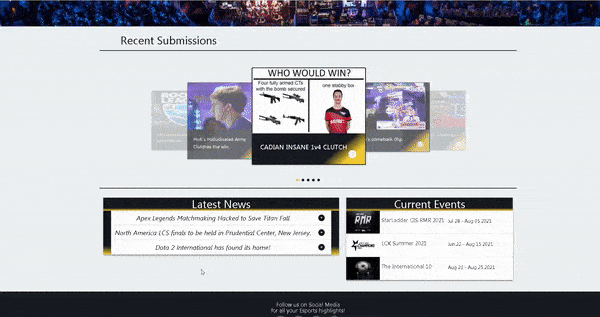

# Esports Epics Testing
The deployed version of the Sorting Visualiser can be found at [Esports Epics](https://esports-epics.herokuapp.com/).

The source code for the project can be viewed at [github](https://github.com/jamesr1775/esports-epics).

## Table of Contents

1. [**Testing**](#testing)
    - [**Code Validation**](#code-validation)
2. [**User Stories Tests**](#testing-user-stories)
3. [**Manual Testing**](#manual-testing)
    - [**Site Header**](#site-header)
    - [**Esports Video Modal**](#esports-video-modal)
    - [**Profile**](#profile)
    - [**Browse Page**](#browse-page)
    - [**Footer**](#footer)
4. [**Further Testing**](#further-testing)
5. [**Bugs and Issues Resolved**](#bugs-and-issues-resolved)
6. [**Unsolved Bugs**](#unsolved-bugs)

## Testing
### Code Validation
* The HTML passed and showed no errors in the [W3C Markup Validation](https://validator.w3.org/)
* The CSS passed and showed no errors in the [W3C CSS validation ](https://jigsaw.w3.org/css-validator/validator)
* The Java Script was tested and no errors were found using [JSHint](https://jshint.com/)
* The python Pep8 standard was checked with the IDE and also [pep8online](http://pep8online.com/) 

### Testing User Stories
1. To be able to navigate the website efficiently and intuitively so that I can find posts that capture my interest or make a new post myself.
    - The site navigation bar is at the top of the screen and contains links to create content or browse posts by all users.
    - The home page contains hero image and a carousel of recent posts to capture the users attention and get them wanting to browse other content.
    - The text inside the hero image immediately tells the user what the site is about.
    - User account creation and logging in/out are located in the navbar and the navbar updates appropiate links to show a certain user account if they are logged in.
    
 

    

    
    

2. A place / library of the best esports moments so that I can view them for enjoyment and share them with others.
    - The homepage has the most recent submissions by all the users in a carousel users can click on to open the information and the video itself.
    - Users can go over to the browse page to view and filter all the sites user's posts so they can find games or players they are interested in.
    - User's can share the youtube video link with the inherent share feature of the embedded youtube video.
3. Read the context behind the clip or moment so that I can understand why it is an amazing play.
    - The cards that contains the user's posts in the browse page has a section users submit descriptions for to explain the video / esports moment so others can get more incite into what is going on in the video.
    
 

    

    
    

4. The ability to add clips / competitive moments so I can contribute to the collections of great esports moments so others can view them.
    - Users can add their own epics by using the submit epic link in the navigation bar.
    - The form has validation so that users are required to submit correct and a minimum / maximum amount of information to the post.
    - Users submissions will appear in the carousel if most recent, otherwise they can be viewed on the browse page.
5. Be able to edit or delete esports posts that I added incase I made a mistake or the post already exists.
    - In a users profile page, a section exists for any content they have submitted to the site. The content they submitted is shown along with an edit button that loads up the information they previously submitted back into the same form so they may edit and update it.
    - A delete button is also present and will delete the correct content / post if pressed. A confirmation to delete is shown to prevent misclicks and mistakes.
    
 

    

    
    

6. To be able to filter all the moments by intuitive categories such as game, genre or date so I can quickly navigate to games / clips that interest me.
    - In the browse page users can filter all the epics displayed to by game ,genre, tournament, year, player, title and description.
    - They can combine searches by typing multiple things such as two or three games or a player and a game etc.

7. View upcoming esports tournaments so I know when they will be live in order to watch them.
    -  The upcoming and ongoing tournaments are displayed on the homepage in an accordion.
    - Clicking on a tournament opens a drop down tab with the tournament information.
8. Add upcoming esports tournaments so that other users can benefit from knowing when tournaments are live.
    - All users can submit esports tournaments so that they will appear for other users benefit in the home page.
    - The input form requires important information esports viewers would want to know such as the date and time of a tournament.
9. Be able to edit or delete tournament posts that I have added to keep the information reliable and up to date.
    - There is a section in the user profile that shows a user and / or moderator account the tournaments they or others have created.
    - A moderator account can also edit and delete entries in order to not have duplicates or outdated tournaments on the home page causing clutter.
    
 

    

    
    

10. Find the contact information and social media links easily so I can keep up to date with the website and posts.
    - The websites social media links are located in the footer of all the webpage routes.
    - Each button will open up the correct corresponding media link in a new tab.

### Manual Testing
* All manual tests below:
    - were ran on chrome and firefox.
    - were repeated on various screen resolutions using the chrome and firefox developer tools that include desktops, ipad, ipad pro, iphone X, 5, 6 ,7 , 8 and the plus models.
    - were repeated on the developers own smartphone (samsung) and tablet (ipad), desktop and laptop.

#### Site Header

##### Device Specific Layout Checks
- The Header responsiveness was tested by varying the screen size to see that the logo and navbar were responsive and also that the navbar becomes an expandable burger icon on smartphones and tablets.
- The logo stays to the left of the header on tablets and desktops but moves to the center for small and extra small screen sizes.

##### Site Header Tests
- The logo was tested that when it is pressed it returns / refreshes to the home page.
- Each link was tested to make sure it brings the user to the correct page or logs them in or out.
- Make sure that submit epic, add event, profile, log out pages only appear after a user is logged in.
- Make sure the register and log in buttons disappear when logged in and that the log out button appears.
- The logout button correctly hides the links shown to logged in users and shows the register and log in buttons.

#### Esports Video Modal
- The video modal should be shown when a user clicks on the VOD here button or the play button in the browse and profile page cards of epics.
- The title of the esports post should be above the video iframe.
- The video should autoplay when the iframe loads.
- Video controls to pause or mute the video are available to the user.
- Upon clicking the close button or dismissing the modal by clicking out of it, the modal should close and the video / audio should stop.
- The video should restart upon closing and reopening the modal.
#### Profile
##### Device Specific Layout Checks
- The number of esports posts per row should be 3 for laptops and desktops, 2 per row for tablets and 1 per row on smart phones.
- The images and cards scale to the device width.
##### Profile Tests
- The user information is displayed in a card at the top of the page under the navbar.
- The delete account button pops up a modal that asks the user to confirm the deletion of the account
    - If the user presses cancel the modal should close and the user remains on the profile page.
    - If the user confirms account deletion, their account is removed from the data base and they are returned to the default home page with no `session['user']`.
- The esports posts card titles and images all open up the video modal.
- The edit button brings the user to the edit esports epic page. 
    - The form should load all the posts information into the input fields for convenience.
- The delete button for a post pops up a modal that asks the user to confirm the deletion of the post.
    - If the user presses cancel the modal should close and the post should remain in the database.
    - If the user confirms post deletion, their post is removed from the data base and they are returned to updated profile page.

#### Browse Page
##### Device Specific Layout Changes
- The number of esports posts per row should be 3 for laptops and desktops, 2 per row for tablets and 1 per row on smart phones.
- The images and cards scale to the device width.
##### Profile Tests
- The reset and search button remain centered on the screen under the input search field.
- 

#### Footer
- The social media icons opens up the relevant social media platforms in a new tab.

#### Further Testing
- I asked friends and family to test and interact with the site on their own devices which included ipads, iphones and samsung phones.
- Tested myself on physical devices laptop, desktop, ipad, samsung phone, iphone.

### Bugs and Issues Resolved
- The logout button sometimes caused the site to crash because the session variables I created did not exist and I was trying to remove them from the session. I solved this by making sure the session variables such as is_journalist is set properly and removed.
- When I fixed the searching to not refresh the page, the dynamic elements could not trigger the modal as they were newly generated. I found to change the jquery for the modal trigger from [stackoverflow](https://stackoverflow.com/questions/12690142/jquery-on-not-registering-in-dynamically-generated-modal-popup)
- Fixed the issue when dismissing the video modal, the video / audio would continue to play in the background. Found information here [stackoverflow](https://stackoverflow.com/questions/37037223/bootstrap-how-to-stop-video-from-playing-after-the-modal-has-been-closed?utm_medium=organic&utm_source=google_rich_qa&utm_campaign=google_rich_qa) to stop the video from playing but I also needed to get rid of the autoplay in the `src` of the iframe. Also found out about the onCloseEnd from [stackoverflow](https://stackoverflow.com/questions/52877745/materializecss-modal-events-not-firing) that allowed me to replace the `src` when dismissing / closing the modal.
- The pagination navigation buttons were not triggering on click events. Found a fix for this from [stackoverflow](https://stackoverflow.com/questions/17936242/dynamically-created-buttons-not-firing-onclick-event)

### Unsolved Bugs
Currently there are no known bugs.